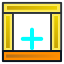
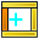
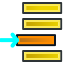

# FreeCAD Bespoke Furniture

A FreeCAD macro for designing bespoke furniture.

## Available Commands

| Icon | Command | Description |
| :---: | :--- | :--- |
|  | Add bottom beam | Add bottom beam |
|  | Add top beam | Add top beam |
|  | Add left panel | Add left panel |
|  | Add right panel | Add right panel |
|  | Add vertical part | Add vertical part |
|  | Add horizontal part | Add horizontal part |
|  | Add back | Add back |
|  | Add door | Add door |
|  | Add drawer front | Add drawer front |
|  | Add vertical part right slope | Add vertical part right slope |
|  | Add vertical part left slope | Add vertical part left slope |
|  | Add door left slope | Add door left slope |
|  | Add back left slope | Add back left slope |
|  | Add several tab as shelf | Add several tab as shelf |
|  | Remove selected objects | Remove selected objects |
|  | Horizontal between 2 vertical | Horizontal between 2 vertical |
|  | Vertical between 2 horizontal | Vertical between 2 horizontal |
|  | Set one between other | Set one between other |
|  | Set slope vertical part on H one | Set slope vertical part on H one |
|  | Cut the selected tab | Cut the selected tab |
|  | Add selection to BOM | Add BOM custom properties to the selected objects |
|  | BOM prop to spreadsheet | Copy BOM properties when BOM_destination is True in 'BOM' spreadsheet |
|  | BOM prop tools | Tools to manage objects with BOM properties |
|  | Panels management | Panels management |
|  | Document panel management | Document panel management |
|  | Manufacturing step management | Manufacturing step management |
|  | Nesting | Nesting |
|  | Copy to external spreadsheet | Copy to external spreadsheet |
|  | Current panel choice | Current panel choice used by the other tools (Add tab...) |
|  | Start the RPC server | Start the RPC server |
|  | Stop the RPC server | Stop the RPC server |
|  | Restart the RPC server | Restart the RPC server |
| | Geo meuble | Geométrie simplifiée du meuble |
